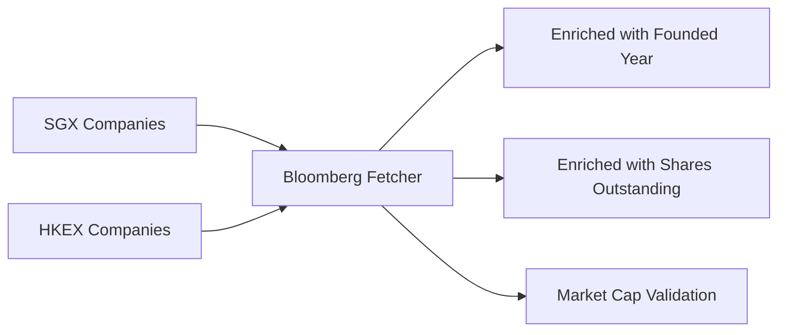

## Overview

The Bloomberg data source enriches SGX and HKEX company data with additional background information from Bloomberg's market data API, including company founding years, shares outstanding, and market capitalization cross-references.

<Info>
  **Data Source**: Bloomberg Markets API at `www.bloomberg.com/markets2/api`
  
  **Use Case**: Secondary enrichment layer for historical and background data
</Info>

## Architecture

Bloomberg fetcher operates as an enrichment layer:



### API Endpoint

```python
BASE_URL = "https://www.bloomberg.com/markets2/api/quote/EQT"
```

**URL Pattern:**
```
https://www.bloomberg.com/markets2/api/quote/EQT/{TICKER}
```

Example: `https://www.bloomberg.com/markets2/api/quote/EQT/D05:SP`

## Ticker Format

Bloomberg uses exchange-specific ticker formats:

### SGX Tickers

```python
# Format: {SYMBOL}:SP
from bloomberg_sp_company_list import BloombergSPCompanyFetcher

fetcher = BloombergSPCompanyFetcher()

# Convert SGX symbol to Bloomberg ticker
ticker = fetcher.to_bloomberg_ticker("D05", suffix="SP")
print(ticker)  # Output: "D05:SP"

ticker = fetcher.to_bloomberg_ticker("Z74", suffix="SP")
print(ticker)  # Output: "Z74:SP"
```

### HKEX Tickers

```python
# Format: {SYMBOL}:HK (with zero-padding variants)

# Generates multiple candidates for HKEX
candidates = fetcher.ticker_candidates("700", mic="XHKG")
print(candidates)  # ["0700:HK", "700:HK"]

candidates = fetcher.ticker_candidates("9988", mic="XHKG")
print(candidates)  # ["9988:HK"]
```

<Note>
  HKEX symbols may be represented with or without zero-padding. The fetcher tries both variants.
</Note>

## Usage Example

<CodeGroup>
```python Basic Usage
from bloomberg_sp_company_list import BloombergSPCompanyFetcher
from sgx_company_list import SGXCompanyFetcher

# Fetch SGX companies first
sgx_fetcher = SGXCompanyFetcher()
sgx_companies = sgx_fetcher.get_company_list(include_null_companies=False)

# Initialize Bloomberg fetcher
bloomberg = BloombergSPCompanyFetcher()

# Enrich with Bloomberg data
def progress(current, total):
    if current % 25 == 0 or current == total:
        pct = (current / total) * 100
        print(f"Progress: {current}/{total} ({pct:.1f}%)")

enriched = bloomberg.fetch_background_for_companies(
    sgx_companies,
    delay_per_request=0.1,
    progress_callback=progress
)

# Access enriched data
for company in enriched:
    if company['fetch_ok']:
        print(f"{company['symbol']}: {company['name']}")
        print(f"  Founded: {company['founded_year']}")
        print(f"  Shares: {company['shares_outstanding']:,.0f}")
        print(f"  Market Cap: {company['market_cap']:,.0f}")
```

```python Single Quote Fetch
# Fetch a single company quote
fetcher = BloombergSPCompanyFetcher()

# Fetch by symbol
quote = fetcher.fetch_quote("D05", suffix="SP")

if quote:
    print(f"Market Cap: {quote.get('marketCap')}")
    print(f"Shares Outstanding: {quote.get('sharesOutstanding')}")
    print(f"Founded: {quote.get('foundedYear')}")
```

```python With Candidate Tickers
# For HKEX, try multiple ticker formats
fetcher = BloombergSPCompanyFetcher()

symbol = "700"
candidates = fetcher.ticker_candidates(symbol, mic="XHKG")
print(f"Trying candidates: {candidates}")

quote, matched_ticker = fetcher.fetch_quote_with_candidates(
    symbol,
    candidates,
    timeout=8
)

if quote:
    print(f"Matched ticker: {matched_ticker}")
    print(f"Company data: {quote}")
else:
    print(f"Failed to fetch data for {symbol}")
    # Access debug info
    debug = fetcher.get_last_request_debug()
    print(f"Last error: {debug['error']}")
```
</CodeGroup>

## Data Fields

The Bloomberg fetcher returns enriched company dictionaries:

<Tabs>
  <Tab title="Identification">
    | Field | Type | Description |
    |-------|------|-------------|
    | `symbol` | string | Original exchange symbol |
    | `name` | string | Company name |
    | `mic` | string | Market Identifier Code (XSES, XHKG) |
    | `bloomberg_ticker` | string | Bloomberg ticker format |
    | `source_url` | string | Bloomberg API URL used |
  </Tab>
  
  <Tab title="Enriched Fields">
    | Field | Type | Description |
    |-------|------|-------------|
    | `market_cap` | float | Market capitalization (parsed) |
    | `shares_outstanding` | float | Total shares outstanding |
    | `founded_year` | int | Year company was founded |
    | `currency` | string | Fundamental data currency |
  </Tab>
  
  <Tab title="Status">
    | Field | Type | Description |
    |-------|------|-------------|
    | `fetch_ok` | boolean | Whether fetch succeeded |
  </Tab>
</Tabs>

## Field Extraction Logic

Bloomberg responses have inconsistent field names. The fetcher uses fallback logic:

```python
# From bloomberg_sp_company_list.py:211-281
def _extract_company_fields(self, payload: dict) -> dict:
    """Extract company fields with multiple fallback strategies."""
    market_cap_raw = None
    shares_raw = None
    founded_raw = None
    currency = None
    
    if isinstance(payload, dict):
        # Try top-level camelCase fields first
        market_cap_raw = self._get_first_dict_value(
            payload,
            ["marketCap", "marketcap", "market_cap", "marketCapitalization"],
        )
        shares_raw = self._get_first_dict_value(
            payload,
            ["sharesOutstanding", "sharesoutstanding", "shares_outstanding", 
             "totalSharesOutstanding", "shout"],
        )
        founded_raw = self._get_first_dict_value(
            payload,
            ["foundedYear", "foundedyear", "founded", "yearFounded", 
             "incorporationYear"],
        )
        currency = self._get_first_dict_value(
            payload,
            ["fundamentalDataCurrency", "issuedCurrency", "currency", 
             "currencyCode", "crncy"],
        )
    
    # Fallback: Deep search through entire payload
    if market_cap_raw is None:
        market_cap_raw = self._find_first_value(
            payload,
            {"marketcap", "market_cap", "marketcapitalization", 
             "curmktcap", "currentmarketcap"},
        )
    # ... similar for other fields
    
    return {
        "market_cap": self._parse_float(market_cap_raw),
        "shares_outstanding": self._parse_float(shares_raw),
        "founded_year": self._parse_year(founded_raw),
        "currency": currency,
    }
```

<Info>
  The dual-strategy approach (top-level + deep search) ensures maximum field extraction success rate.
</Info>

## Value Parsing

Bloomberg returns values with unit suffixes that need parsing:

### Float Parsing with Units

```python
# From bloomberg_sp_company_list.py:145-168
@staticmethod
def _parse_float(value: Any) -> Optional[float]:
    """Parse float values with K/M/B/T suffixes."""
    if value is None:
        return None
    
    if isinstance(value, (int, float)):
        return float(value)
    
    text = str(value).strip()
    if not text:
        return None
    
    # Match pattern: "123.45B" or "2,227.62M"
    match = re.fullmatch(r"(-?[\d,.]+)\s*([KMBT])?", text, flags=re.IGNORECASE)
    if not match:
        return None
    
    number = match.group(1).replace(",", "")
    suffix = (match.group(2) or "").upper()
    multiplier = {"": 1.0, "K": 1e3, "M": 1e6, "B": 1e9, "T": 1e12}[suffix]
    
    try:
        return float(number) * multiplier
    except ValueError:
        return None
```

**Examples:**
- `"365.42B"` → `365420000000.0`
- `"2,227.62M"` → `2227620000.0`
- `"15.3K"` → `15300.0`

### Year Parsing

```python
# From bloomberg_sp_company_list.py:170-185
@staticmethod
def _parse_year(value: Any) -> Optional[int]:
    """Extract year from various formats."""
    if value is None:
        return None
    
    if isinstance(value, int) and 1000 <= value <= 2100:
        return value
    
    # Search for 4-digit year pattern
    match = re.search(r"(19|20)\d{2}", str(value))
    if not match:
        return None
    
    year = int(match.group(0))
    if 1000 <= year <= 2100:
        return year
    return None
```

**Examples:**
- `"1968"` → `1968`
- `"Founded in 1995"` → `1995`
- `"2005-01-15"` → `2005`

## Ticker Candidate Generation

For HKEX symbols, generates multiple variants:

```python
# From bloomberg_sp_company_list.py:131-143
def ticker_candidates(self, symbol: str, mic: str) -> list[str]:
    """Generate Bloomberg ticker candidates."""
    clean = self.normalize_symbol(symbol)
    mic_upper = str(mic or "").upper()
    
    if mic_upper == "XHKG":
        # Bloomberg can be 0005:HK or 5:HK; try both
        if clean.isdigit():
            padded = clean.zfill(4)
            return [f"{padded}:HK", f"{clean}:HK"]
        return [f"{clean}:HK"]
    
    # Default SGX style
    return [f"{clean}:SP"]
```

<CodeGroup>
```python SGX Examples
fetcher.ticker_candidates("D05", "XSES")
# ["D05:SP"]

fetcher.ticker_candidates("Z74", "XSES")
# ["Z74:SP"]
```

```python HKEX Examples
fetcher.ticker_candidates("700", "XHKG")
# ["0700:HK", "700:HK"]

fetcher.ticker_candidates("9988", "XHKG")
# ["9988:HK", "9988:HK"]  # No padding needed

fetcher.ticker_candidates("1", "XHKG")
# ["0001:HK", "1:HK"]
```
</CodeGroup>

## Batch Enrichment

```python
# From bloomberg_sp_company_list.py:283-335
def fetch_background_for_companies(
    self,
    companies: list[dict],
    mic: str = "XSES",
    delay_per_request: float = 0.1,
    max_workers: int = 1,
    request_timeout: int = 8,
    progress_callback=None,
) -> list[dict]:
    """Fetch Bloomberg background for a list of companies."""
    total = len(companies)
    completed = 0
    results: list[dict] = []
    
    for company in companies:
        symbol = self.normalize_symbol(company.get("symbol", ""))
        name = company.get("name")
        ticker_candidates = self.ticker_candidates(symbol, mic=mic)
        bloomberg_ticker = ticker_candidates[0] if ticker_candidates else None
        
        if delay_per_request > 0:
            time.sleep(delay_per_request)
        
        payload, matched_ticker = self.fetch_quote_with_candidates(
            symbol,
            ticker_candidates,
            timeout=request_timeout,
        )
        resolved_ticker = matched_ticker or bloomberg_ticker
        
        item = {
            "symbol": symbol,
            "name": name,
            "mic": mic,
            "bloomberg_ticker": resolved_ticker,
            "source_url": (
                f"{self.BASE_URL}/{quote(resolved_ticker, safe='')}"
                if resolved_ticker
                else None
            ),
            "market_cap": None,
            "shares_outstanding": None,
            "founded_year": None,
            "currency": None,
            "fetch_ok": payload is not None,
        }
        
        if payload:
            item.update(self._extract_company_fields(payload))
        
        results.append(item)
        completed += 1
        if progress_callback:
            progress_callback(completed, total)
    
    return results
```

<Warning>
  Bloomberg enrichment is **sequential** (max_workers=1) to avoid rate limiting. For 600 companies with 100ms delay, expect ~60 seconds.
</Warning>

## Example Response

```json
{
  "symbol": "D05",
  "name": "DBS Group Holdings Ltd",
  "mic": "XSES",
  "bloomberg_ticker": "D05:SP",
  "source_url": "https://www.bloomberg.com/markets2/api/quote/EQT/D05%3ASP",
  "market_cap": 103582000000.0,
  "shares_outstanding": 2715234000.0,
  "founded_year": 1968,
  "currency": "SGD",
  "fetch_ok": true
}
```

## Data Quality Statistics

<CardGroup cols={3}>
  <Card title="Market Cap Coverage" icon="dollar-sign">
    ~70% of SGX companies
  </Card>
  <Card title="Shares Coverage" icon="chart-simple">
    ~65% of SGX companies
  </Card>
  <Card title="Founded Year Coverage" icon="calendar">
    ~50% of SGX companies
  </Card>
</CardGroup>

<Info>
  Bloomberg coverage is lower than primary sources (SGX/HKEX). Use as supplementary data only.
</Info>

## Error Handling & Debug

The fetcher tracks detailed debug information:

```python
# Access last request debug info
fetcher = BloombergSPCompanyFetcher()

quote, matched = fetcher.fetch_quote_with_candidates(
    "INVALID",
    ["INVALID:SP"],
    timeout=8
)

if not quote:
    debug = fetcher.get_last_request_debug()
    print(f"Symbol: {debug['symbol']}")
    print(f"Ticker tried: {debug['ticker']}")
    print(f"Status code: {debug['status_code']}")
    print(f"Error: {debug['error']}")
    print(f"Response preview: {debug['response_text'][:200]}")
```

<Accordion title="Debug Info Structure">
```python
{
    "symbol": "D05",
    "ticker": "D05:SP",
    "url": "https://www.bloomberg.com/markets2/api/quote/EQT/D05%3ASP",
    "status_code": 200,
    "error": None,
    "response_text": "{...}"  # First 8000 chars
}
```
</Accordion>

## Rate Limiting

<Warning>
  Bloomberg has strict rate limiting. Always use sequential processing with delays.
</Warning>

```python
# Recommended: Sequential with 100ms delay
enriched = bloomberg.fetch_background_for_companies(
    companies,
    delay_per_request=0.1,  # 100ms between requests
    max_workers=1  # Sequential only
)

# For small batches (<50 companies): 50ms delay
enriched = bloomberg.fetch_background_for_companies(
    companies[:50],
    delay_per_request=0.05,
    max_workers=1
)
```

## Integration Example

Combine SGX, HKEX, and Bloomberg data:

```python
from sgx_company_list import SGXCompanyFetcher
from hkex_company_list import HKEXCompanyFetcher
from bloomberg_sp_company_list import BloombergSPCompanyFetcher

# Fetch SGX companies
sgx = SGXCompanyFetcher()
sgx_companies = sgx.get_company_list(include_null_companies=False)
sgx_companies = [c for c in sgx_companies if not c['is_suspended']]

print(f"SGX: {len(sgx_companies)} companies")

# Enrich with Bloomberg
bloomberg = BloombergSPCompanyFetcher()
sgx_enriched = bloomberg.fetch_background_for_companies(
    sgx_companies,
    mic="XSES",
    delay_per_request=0.1
)

# Merge Bloomberg data back into SGX companies
for i, company in enumerate(sgx_companies):
    bb_data = sgx_enriched[i]
    if bb_data['fetch_ok']:
        company['founded_year'] = bb_data['founded_year']
        company['shares_outstanding'] = bb_data['shares_outstanding']
        company['bb_market_cap'] = bb_data['market_cap']
        company['bb_currency'] = bb_data['currency']

# Export combined data
import json
with open('sgx_with_bloomberg.json', 'w') as f:
    json.dump(sgx_companies, f, indent=2)

print("Enrichment complete!")
```

## Use Cases

<CardGroup cols={2}>
  <Card title="Historical Research" icon="clock">
    Find company founding years for historical analysis
  </Card>
  <Card title="Share Analysis" icon="chart-pie">
    Calculate free float and ownership percentages
  </Card>
  <Card title="Market Cap Validation" icon="shield-check">
    Cross-reference market cap with primary sources
  </Card>
  <Card title="Currency Conversion" icon="money-bill-transfer">
    Identify fundamental data currency for FX adjustments
  </Card>
</CardGroup>

## Limitations

<Warning>
  **Bloomberg limitations:**
  - Not all companies have complete data
  - Founded year coverage ~50%
  - Strict rate limiting (100ms minimum delay)
  - Sequential processing only
  - Some ticker formats may not match
</Warning>

<Info>
  **Best practice:** Use Bloomberg as supplementary enrichment after fetching primary data from SGX/HKEX.
</Info>

## Next Steps

<CardGroup cols={2}>
  <Card title="SGX Data Source" icon="dollar-sign" href="/data-sources/sgx">
    Fetch primary SGX company data
  </Card>
  <Card title="HKEX Data Source" icon="money-bill" href="/data-sources/hkex">
    Fetch primary HKEX company data
  </Card>
  <Card title="Data Sources Overview" icon="database" href="/data-sources/overview">
    Compare all data sources
  </Card>
  <Card title="Quickstart" icon="rocket" href="/quickstart">
    Get started with a simple example
  </Card>
</CardGroup>