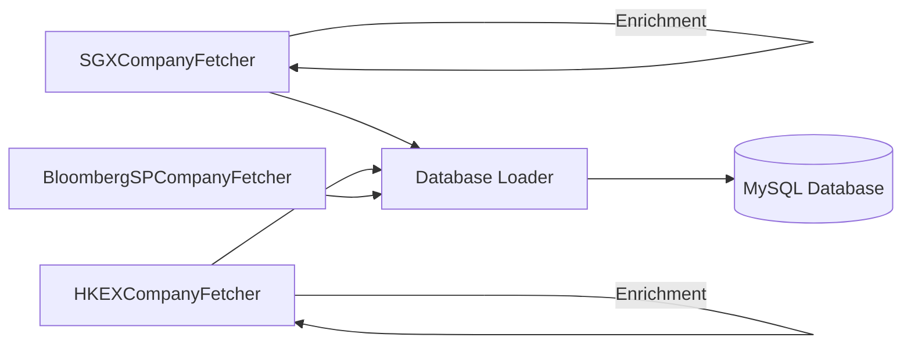

## Overview

Exchanges Metadata is a Python toolkit for fetching and enriching company listings from major Asian stock exchanges. It provides automated data collection from SGX (Singapore Exchange) and HKEX (Hong Kong Exchange), enhanced with Bloomberg market metadata.

The toolkit handles rate limiting, multi-threaded enrichment, and automatic filtering of suspended companies and trading-only listings. All data can be synced to MySQL databases with configurable table management.

## Key features

<CardGroup cols={2}>
  <Card
    title="SGX company listings"
    icon="building"
    href="#sgx-features"
  >
    Fetch Singapore Exchange equities with market cap, P/E ratios, and sector data
  </Card>
  <Card
    title="HKEX company listings"
    icon="chart-line"
    href="#hkex-features"
  >
    Retrieve Hong Kong Exchange equities with industry classifications and listing categories
  </Card>
  <Card
    title="Bloomberg enrichment"
    icon="database"
    href="#bloomberg-features"
  >
    Enrich company data with Bloomberg metadata including shares outstanding and founded year
  </Card>
  <Card
    title="MySQL database sync"
    icon="arrows-rotate"
    href="#database-features"
  >
    Load and sync data to MySQL with configurable table management
  </Card>
</CardGroup>

### SGX features

- Real-time data from SGX stock screener and securities APIs
- Financial metrics: market cap, P/E ratio, yield, debt-to-equity, ROE
- Price changes over 4-week, 13-week, 26-week, and 52-week periods
- Automatic filtering of suspended companies
- Multi-threaded sector enrichment with progress tracking

### HKEX features

- Company listings from HKEX webhook or direct API
- HSIC industry and sub-sector classifications
- Listing categories and dates
- Automatic filtering of "Trading Only" listings
- Configurable rate limiting for API calls

### Bloomberg features

- Market capitalization and shares outstanding
- Company founded year and currency information
- Smart ticker resolution for SGX (`:SP` suffix) and HKEX (`:HK` suffix)
- Automatic retry logic with token refresh

### Database features

- SQLAlchemy-based MySQL integration
- Replace or append modes for table updates
- Automatic serialization of complex data types
- Batched inserts with configurable chunk sizes
- UTC timestamp tracking for all fetches

## Getting started

<CardGroup cols={2}>
  <Card
    title="Installation"
    icon="download"
    href="/installation"
  >
    Install dependencies and set up your environment
  </Card>
  <Card
    title="Quickstart"
    icon="rocket"
    href="/quickstart"
  >
    Fetch your first SGX company listing in minutes
  </Card>
</CardGroup>

## Use cases

<AccordionGroup>
  <Accordion title="Financial data analysis">
    Build datasets for quantitative analysis, sector comparisons, and market research. The toolkit provides comprehensive financial metrics including P/E ratios, market cap, yield percentages, and profitability indicators.
  </Accordion>

  <Accordion title="Portfolio screening">
    Filter companies by market cap, sector, industry, or financial metrics. Automatically exclude suspended companies and trading-only listings to focus on active equities.
  </Accordion>

  <Accordion title="Market surveillance">
    Track listing status changes, suspension flags, and company metadata updates. The fetched_at_utc timestamp enables historical tracking of changes.
  </Accordion>

  <Accordion title="Data warehousing">
    Sync exchange metadata to your MySQL database on a scheduled basis. Support for both replace and append modes enables flexible data pipeline architectures.
  </Accordion>
</AccordionGroup>

## Architecture

The toolkit consists of three main fetcher classes and a database loader:

Each fetcher operates independently and can be used standalone or combined through the database loader for comprehensive market coverage.